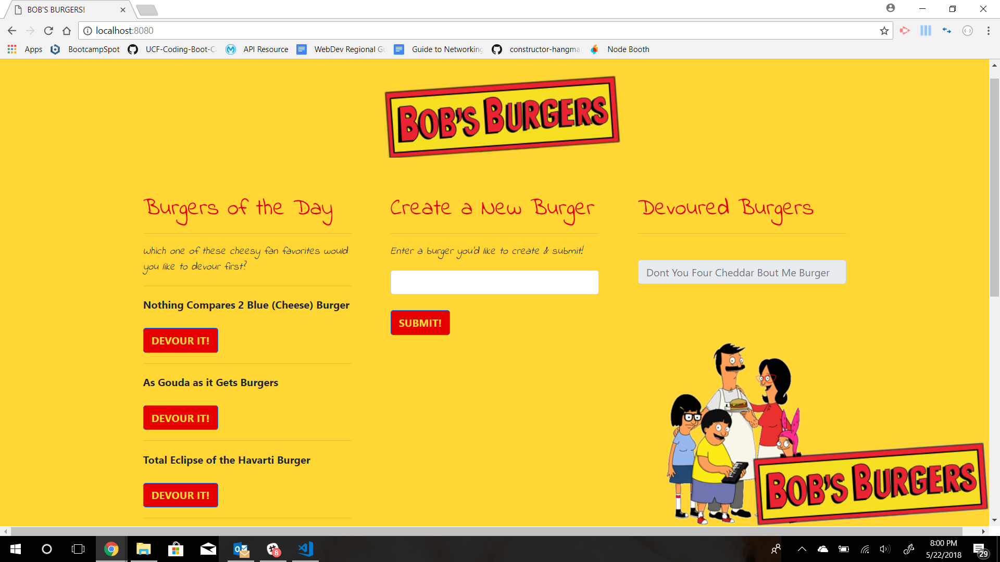

## Burgers
UCF Coding Bootcamp Week 14 Homework

## Functionality
This Bob's Burger's themed application uses Express and Node.js to allow the user to devour (update) "Burgers of the Day" that are already in a MySQL database which will then be posted under "Devoured Burgers". User's can also submit (create) a new burger, which will then be posted under "Burgers of the Day".  

## Deployment
* Github: https://github.com/ksouders92/Burgers/
* Heroku: https://shielded-gorge-10073.herokuapp.com/
